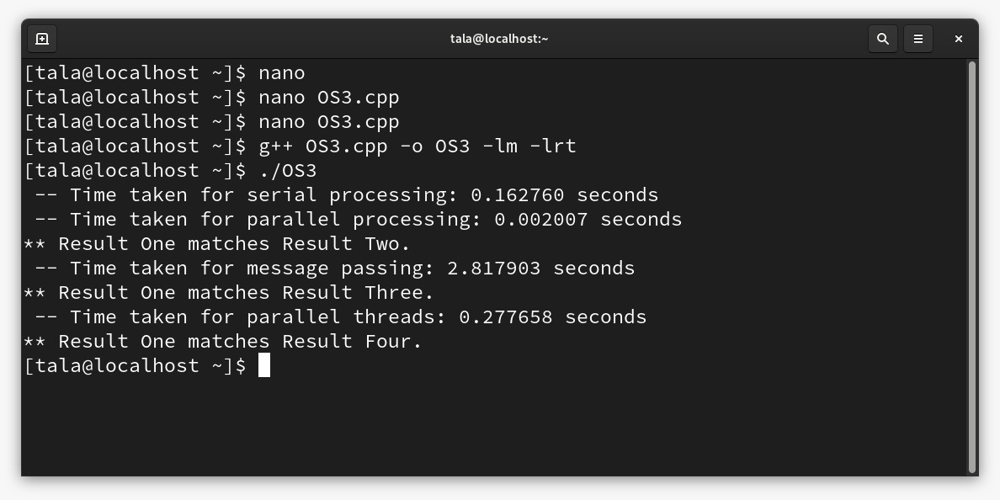

# Operating System HW: Parallel and Serial Processing of Data Packets

## Project Description
This project demonstrates different parallel computing techniques for processing data packets in a high-performance system. The goal is to compute the result of raising elements of one packet to the power of the corresponding elements in another packet.

Techniques used:
- **Serial Processing**
- **Shared Memory Parallelism**
- **Message Passing**
- **Parallelism Using Threads**

The application handles large datasets (up to 12 million elements) and compares performance in different processing modes.

## Features
- **Serial processing** computes the result sequentially.
- **Shared memory parallel processing** uses `shm_open` to share memory between processes.
- **Message passing** uses named pipes (FIFO) to communicate between processes.
- **Parallel processing using threads** utilizes C++ threads for concurrent computation.

## Dependencies
- **C++ Compiler**: A C++ compiler like GCC (for Linux) is required.
- **POSIX Shared Memory**: Used for shared memory parallelism (`shm_open`).
- **Named Pipes (FIFO)**: Used for message passing.
- **C++ Threads**: Used for parallelism in thread-based processing.

## Performance Comparison
This project benchmarks the different processing modes (serial vs parallel) to show the performance improvements when using parallel processing techniques. The results for serial, shared memory, message passing, and thread-based parallelism are computed and compared in terms of execution time.

